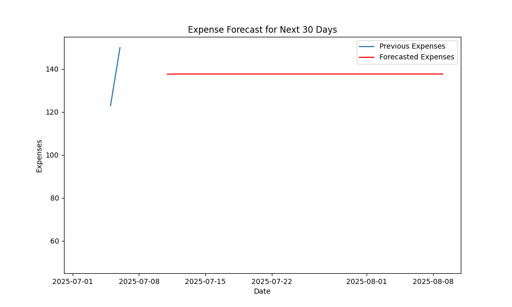

# Track Expense





## Overview

Track Expense is a comprehensive personal expense tracker web application built using Django. It allows users to log their expenses, categorize them automatically using machine learning, and provides future expense predictions. Additionally, users can set financial goals and track their progress.

## Features

- **Expense Logging**: Log daily expenses with details such as date, description, amount, and category.

- **Automated Expense Categorization**: Uses a machine learning model to categorize expenses based on descriptions.

- **Future Expense Prediction**: Forecasts expenses for the next 30 days using ARIMA time series modeling.

- **Goal Management**: Set financial goals, add savings amounts, and receive congratulatory notifications upon achievement.

- **User Authentication**: Secure user registration, login, and profile management.

- **Expense Limits**: Set daily expense limits with email alerts when exceeded.

## Setup

To run this application locally, follow these steps:

1. Clone the repository to your local machine:

   ```bash
   git clone https://github.com/yourusername/track-expense.git
   ```

2. Create a virtual environment (optional but recommended):

   ```bash
   python -m venv venv
   ```

3. Activate the virtual environment:

   - **Windows**:

     ```bash
     venv\Scripts\activate
     ```

   - **macOS and Linux**:

     ```bash
     source venv/bin/activate
     ```

4. Install the required dependencies:

   ```bash
   pip install -r requirements.txt
   ```

5. Apply database migrations:

   ```bash
   python manage.py migrate
   ```

6. Create a superuser account to access the admin panel:

   ```bash
   python manage.py createsuperuser
   ```

7. Start the development server:

   ```bash
   python manage.py runserver
   ```

8. Open your web browser and go to `http://localhost:8000` to access the application.

## Usage

1. Register a new account or log in using your credentials.

2. Log your expenses by clicking the "Add Expense" button and filling in the details.

3. View your expense history, categorized expenses, and future expense predictions on the dashboard.

4. Manage your financial goals by adding new goals and tracking your savings progress.

5. Access the admin panel at `http://localhost:8000/admin/` for administrative tasks.

## Contributing

If you'd like to contribute to this project, please follow these steps:

1. Fork the repository on GitHub.

2. Create a new branch for your feature or bug fix:

   ```bash
   git checkout -b feature-name
   ```

3. Make your changes and commit them:

   ```bash
   git commit -m "Add new feature"
   ```

4. Push your changes to your forked repository:

   ```bash
   git push origin feature-name
   ```

5. Create a pull request on the original repository to propose your changes.

## Acknowledgments

- Thanks to the Django community for creating such a powerful web framework.

- The automated expense categorization and prediction features are powered by machine learning models, which were trained using various open-source libraries and datasets.

Feel free to customize and enhance Track Expense according to your needs. Happy budgeting!

## Author

Hamza Abdul Karim
